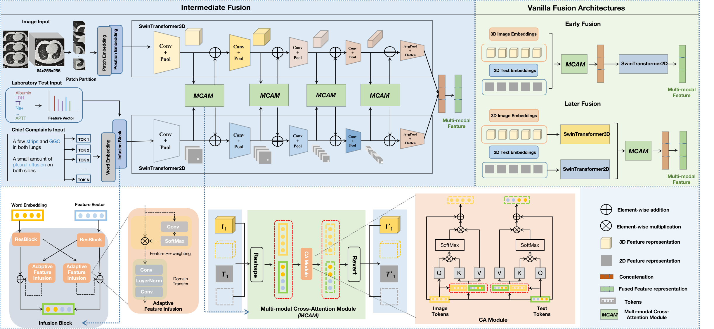

# A multimodal integration system based on artificial intelligence for pneumonia identification and prognosis prediction
Copyright (C) 2023 Jiechao Ma (majch7@mail2.sysu.edu.cn)
## Introduction
This is an implementation of our paper **A multimodal integration system based on artificial intelligence for pneumonia identification and prognosis prediction**.

 This comprehensive package is meticulously crafted to empower seamless and automated diagnosis of infectious diseases, precise pathogen prediction, accurate virus subtype identification, and effective risk assessment for severe pneumonia. Leveraging state-of-the-art multi-task interaction learning from diverse patient information modalities, it stands as a powerful tool for medical professionals and researchers.

Modified from [mmclassification](https://github.com/open-mmlab/mmclassification).



<p align="center">Fig. 1. Framework of our proposed method</p>


## User Guides
### Requirements
- Python 3.6+
- PyTorch 1.3+
- [mmcv](https://github.com/open-mmlab/mmcv) 1.1.4+

### Install
a. Create a conda virtual environment and activate it.

```shell
conda create -n mmi python=3.7 -y
conda activate mmi
```
b. Install PyTorch and torchvision following the [official instructions](https://pytorch.org/), e.g.,

```shell
conda install pytorch torchvision -c pytorch
```
Note: Make sure that your compilation CUDA version and runtime CUDA version match.
You can check the supported CUDA version for precompiled packages on the [PyTorch website](https://pytorch.org/).


```python
# E.g 
# CUDA 11.7
conda install pytorch==1.13.0 torchvision==0.14.0 torchaudio==0.13.0 pytorch-cuda=11.7 -c pytorch -c nvidia
```

c. Clone the repository.

```shell
git clone https://github.com/chiehchiu/MMI.git
cd mmi
```

d. Install build requirements and then install mmi framework.

```shell
pip install -r requirements.txt
python setup.py develop 
```

## Pretrained Models
The pre-training checkpoints we use are available in our [Google Drive/Model Zoo](https://drive.google.com/drive/folders/1iG2t9bh1zu7G2spcohUzLDwrTGmWyQaC?usp=sharing). And the model parameters obtained for each task are also in [Google Drive/Parameters](https://drive.google.com/drive/folders/1A5SU1Uu2_ezy6K-muNsbmGU-tNPQrKw6?usp=sharing)


## Data preparation
Download your own dataset and put it as the following structure:

```
  ├──data
        ├── meta
        │   ├── val.csv
        │   ├── test.csv
        │   ├── train.csv
        ├── val
        │   ├── Patient ID
        │   ├── Patient ID
        │   ├── ...
        ├── test
        │   ├── Patient ID
        │   ├── Patient ID
        │   ├── ...
        └── train
              └── Patient ID1
              │    ├── Study ID1
                        └── Series ID1
              │    ├── Study ID2
              │    ├── ...
              └── Patient ID2
              │    ├── ...
              └── ...
```

Note: The clinica ata used for the pretraining, finetuning, validation, and test MMI framework were collected from the West China Hospital and Chengdu ShangJin Nanfu Hospital maintained by the Frontiers Science Center for Disease-related Molecular Network team from West China Hospital. We are sorry that the raw data from hospitals cannot be made publicly available because of hospital regulation restrictions and privacy concerns to protect our patients. Anonymized data might be accessible for research purposes from the corresponding authors upon reasonable request.


## Configurations
All training parameter configurations in this project are stored in the "configs" directory for easy unified management. 

We take fine-tuning "task1_2cls_model" as an example. The configuration file path of its training parameters is configs/pne_ct/task1_2cls_model.py. 
Readers can modify the training parameters in the file according to their own hardware conditions.

The training parameters are described in detail as follows:
```python
pretrained: The pre-training parameters used can be downloaded in our model zoo.
model_type: The type of model used to extract CT images and clinical texts features and then combine the two. e.g.: SwinLePETransformer3D
samples_per_gpu: specifies the batch size of each GPU card.
optimizer: For full parameter tuning, "AdamW" is recommended.
lr_config: learning rate change policy.
```

Run this script to train and test a SwinLePETransformer3D model on your dataset.
```
#E.g.
bash scripts/task1_pne_infections_2cls.sh train
bash scripts/task1_pne_infections_2cls.sh test
```

## Contact
If you have questions or suggestions, please open an issue here.

